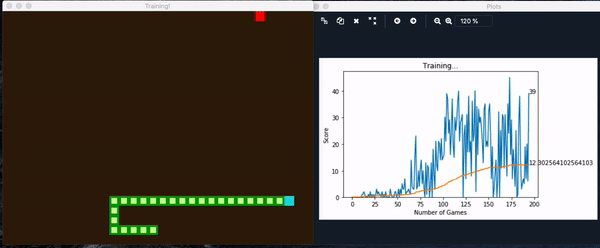

# Teaching AI to Play Snake : Deep Reinforcement Learning
Used fundamentals of Reinforcement Learning (Neural Networks + Q-Learning) to teach Snake to find food in Pygame. Used Deep Reinforcement Learning algorithm using Keras on top of Tensorflow. This approach consists in giving the system parameters related to its state and a positive or negative reward based on its actions. No rules about the game are given, and initially, the agent has no information on what it needs to do. The goal for the system is to figure it out and elaborate a strategy to maximize the score — or the reward.

Used 11 boolean variables as the input. Training model used 3 fully connected layers (input, hidden, output). It takes into account:
- if there’s an immediate danger in the snake’s proximity (right, left and straight).
- if the snake is moving up, down, left or right.
- if the food is above, below, on the left or on the right.

The network receives as input the state, and returns as output three values related to the three actions: move left, move right, move straight. The last layer uses the Softmax function. 

         
There could be a positive reward for each step the snake takes without dying. In that case, the agent might just decide to run in a circle, since it would get positive rewards for each step. Sometimes, Reinforcement Learning agents outsmart us, presenting flaws in our strategy that we did not anticipate.

### Install
To run this project, you need the following packages
1. Pytorch
2. Pygame
3. numpy
4. matplotlib

