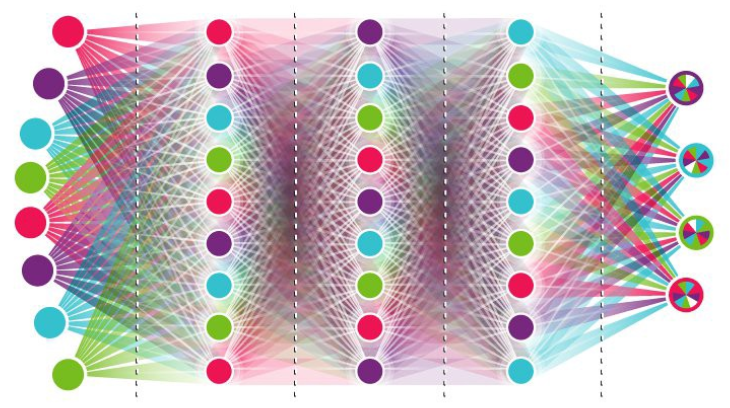

# Teaching AI to Play Snake : Deep Reinforcement Learning
Used fundamentals of Reinforcement Learning (Neural Networks + Q-Learning) to teach Snake to find food in Pygame. Used Deep Reinforcement Learning algorithm using Keras on top of Tensorflow. This approach consists in giving the system parameters related to its state and a positive or negative reward based on its actions. No rules about the game are given, and initially, the agent has no information on what it needs to do. The goal for the system is to figure it out and elaborate a strategy to maximize the score — or the reward.

Used 11 boolean variables as the input. Training model used 3 fully connected layers (input, hidden, output) . 

### Install
To run this project, you need the following packages
1. Pytorch
2. Pygame
3. numpy
4. matplotlib

